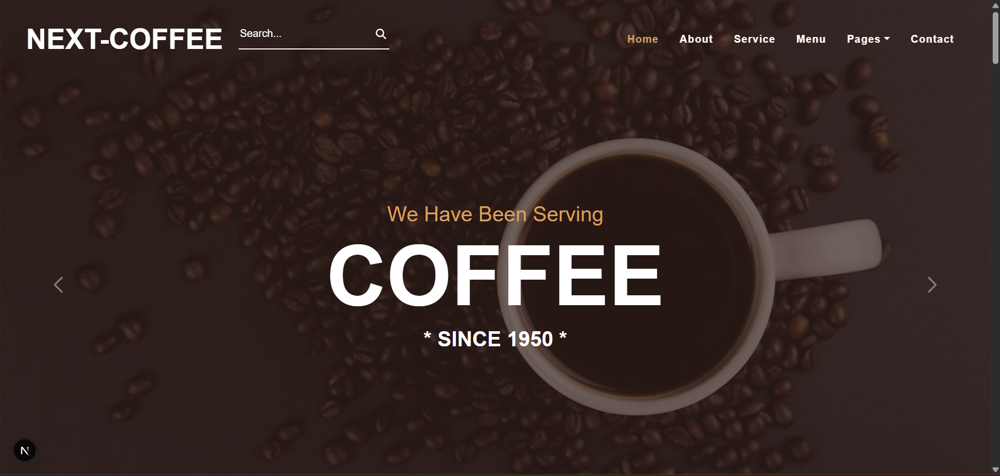

# Next-Coffee

This is a coffee shop storefront built with Next.js Pages Router. It uses JSON Server as a local mock API for products, services, testimonials, newsletter signups, reservations, and contact messages.



## Tech Stack

- Next.js 15
- React 19
- JSON Server
- Swiper
- Font Awesome
- CSS Modules plus global Bootstrap-style utility classes

## Prerequisites

- Node.js 20 or newer is recommended for Next.js 15.
- npm, included with Node.js.

## Getting Started

Install dependencies:

```bash
npm install
```

Start the mock API in one terminal:

```bash
npm run server
```

The JSON Server API runs at:

```text
http://localhost:4000
```

Start the Next.js app in another terminal:

```bash
npm run dev
```

Open the app at:

```text
http://localhost:3000
```

## Available Scripts

```bash
npm run dev
```

Starts the local Next.js development server.

```bash
npm run server
```

Starts JSON Server against `data/db.json` on port `4000`.

```bash
npm run build
```

Creates a production build. Keep the JSON Server running because several pages fetch mock API data during static generation.

```bash
npm run start
```

Serves the production build after `npm run build`.

```bash
npm run lint
```

Runs the configured Next.js lint checks.

On Windows PowerShell, if `npm run ...` is blocked by script execution policy, use `npm.cmd run ...`.

## Project Structure

```text
components/
  modules/       Shared UI pieces such as navbar, footer, cards, page header, and testimonials.
  templates/     Page sections grouped by route or feature area.
data/
  db.json        Mock API data used by JSON Server.
pages/
  _app.js        Global layout shell with navbar and footer.
  index.js       Home page.
  product/[id].js
                 Product detail pages generated from mock product data.
  search/        Server-rendered search page.
public/
  img/           Static images used by page sections and mock data.
styles/
  globals.css    Global utility/theme styles.
  *.module.css   Component-scoped styles.
```

## Routes

- `/` shows the home page with slider, about, services, offer, menu, reservation, and testimonials sections.
- `/about` shows the about page.
- `/services` lists coffee shop services from `services`.
- `/menu` lists hot and cold coffee products from `product`.
- `/product/[id]` shows a product detail page and comments for that product.
- `/reservation` shows the reservation form.
- `/testimonial` shows customer comments.
- `/contact` shows contact details and the contact form.
- `/search?q=<term>` filters products by name or type.

## Mock API Resources

JSON Server exposes these resources from `data/db.json`:

- `services`: service cards used by the home and services pages.
- `product`: menu items and product detail data.
- `comments`: testimonials and product comments.
- `newsPaper`: newsletter signup submissions.
- `reserve`: reservation submissions.
- `massage`: contact form submissions. The name is preserved because existing code posts to this resource.

## Data Fetching

Static pages fetch from `http://localhost:4000` in `getStaticProps` and `getStaticPaths`. The search page uses `getServerSideProps`, and the form sections use client-side `POST` requests to JSON Server.

Because the mock API is local, production builds and static regeneration require JSON Server to be available unless the data source is replaced with a production API.

## Documentation

- [IMPROVEMENTS.md](./IMPROVEMENTS.md) contains a repo review with prioritized improvement opportunities.

## Notes

- This repository does not currently define a license.
- This app uses local mock data and placeholder business content. Replace the mock API and placeholder copy before using it for a production storefront.
